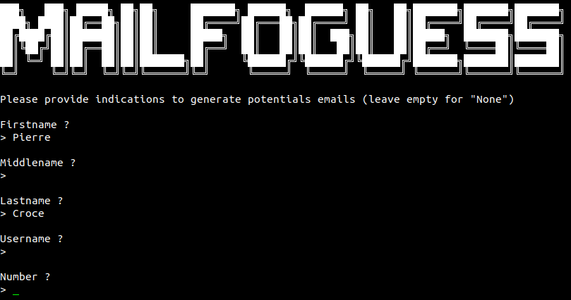

# [Mailfoguess](https://github.com/WildSiphon/Mailfoguess)

**OSINT tool** to **guess** and **verify** the **email address of a person** from  information such as firstname, middlename, lastname, username...    

##  The script

### Operation

An email address is made up from **local-part**, the symbol **@**, and a **domain**. This script does :

- **Create *a lot* of possible local-part** from informations given and following generation level 
- **Add @domain to all local-part** respecting the conditions of creation of mail of these domains
- **Verify these mails** (only for "gmail","laposte","protonmail","yahoo")

##  Installation

### Download files and dependencies

```bash
git clone https://github.com/WildSiphon/Mailfoguess
cd Mailfoguess
pip3 install -r requirements.txt
```

## Use

### Usual use

```
usage: mailfoguess.py [-h] [-f [FIRSTNAME]] [-m [MIDDLENAME]] [-l [LASTNAME]] [-u [USERNAME]] [-n [NUMBER]] [--yes] [--level {min,low,high,max}] [--resume [RESUME_PATH]] [--separators [SEPARATORS]] [--print]
                      [--output [OUTPUT_LOCATION]] [--nb-localparts [NB_PRINT_LOCALPARTS]] [--nb-emails [NB_PRINT_EMAILS]] [--nb-verified [NB_PRINT_VERIFIED]]

python script to guess the potentials email adress of someone

optional arguments:
  -h, --help            show this help message and exit

Target:
  Set known parameters concerning the target

  -f [FIRSTNAME]        set target's firstname
  -m [MIDDLENAME]       set target's middlename
  -l [LASTNAME]         set target's lastname
  -u [USERNAME]         set target's username
  -n [NUMBER]           set a number to use (year of birth, locality...)

Generation:
  Set parameters concerning the generation

  --yes, -Y             assumes "yes" as the answer to all questions of validation
  --level {min,low,high,max}, -L {min,low,high,max}
                        choose level of generation (default 'min')
  --resume [RESUME_PATH], -r [RESUME_PATH]
                        select a json file to resume or enrich wich new options
  --separators [SEPARATORS], -s [SEPARATORS]
                        set separators used for the generation of local-parts (default are '-._')

Output:
  Select how the data will be displayed and/or saved

  --print, -P           print generated informations on screen (local-part, emails and verified emails)
  --output [OUTPUT_LOCATION], -O [OUTPUT_LOCATION]
                        choose output location (default is "./output")
  --nb-localparts [NB_PRINT_LOCALPARTS]
                        set the maximum of local-part printed when informations are displayed (default is 20)
  --nb-emails [NB_PRINT_EMAILS]
                        set the maximum of emails printed per domain when informations are displayed (default is 4)
  --nb-verified [NB_PRINT_VERIFIED]
                        set the maximum of verified emails printed per domain when informations are displayed (default is all)
```

### No interactions mod

You enter the *No interactions mod* when you specify the parameters in the command line.

#### EXAMPLE

```bash
~$ python3 mailfoguess.py -f Pierre -l Croce --print --yes
```


### Interactions mod

You enter *Interactions mod* when no indication are provided to generate potentials emails.

#### EXAMPLE

```bash
$ python3 mailfoguess.py
$ python3 mailfoguess.py --level high
$ python3 mailfoguess.py --yes
```



You will get the same result after this part.

### Caution

Generating email address is very fast but the verification part can last a long time. For example the command below, (a very bad realistic test case), took me almost 6 hours to verify the 10 000 email address generated from 2300 local-part.

```bash
~$ python3 mailfoguess.py -f Bill -m "The Gater" -l Gates -u billythekid -n 1955 --level max --yes
```

If the verification is to long for you, you can at any time press `[ctrl+c]` to stop the script. This will save all the data so you can resume the verification using the `–resume` or `-r` options.

## Output

Results are displayed in console, but everything is recorded and stored by default in `./output/` in a `json` file.

### Example

`pierrecroce.json`

```json
{
  "firstname": "pierre",
  "middlename": null,
  "lastname": "croce",
  "username": null,
  "number": null,
  "local-parts": [
    "croce",
    "p-croce",
    "p.croce",
    "p_croce",
    "pcroce",
    "pierre",
    "pierre-c",
    "pierre-croce",
    "pierre.c",
    "pierre.croce",
    "pierre_c",
    "pierre_croce",
    "pierrec",
    "pierrecroce"
  ],
  "emails": {
    "gmail.com": {
      "p.croce@gmail.com": true,
      "pcroce@gmail.com": true,
      "pierre@gmail.com": false,
      "pierre.c@gmail.com": true,
      "pierre.croce@gmail.com": true,
      "pierrec@gmail.com": true,
      "pierrecroce@gmail.com": true
    },
    "yahoo.com": {
      "croce@yahoo.com": false,
      "p.croce@yahoo.com": false,
      "p_croce@yahoo.com": false,
      "pcroce@yahoo.com": false,
      "pierre@yahoo.com": false,
      "pierre.c@yahoo.com": false,
      "pierre.croce@yahoo.com": false,
      "pierre_c@yahoo.com": false,
      "pierre_croce@yahoo.com": false,
      "pierrec@yahoo.com": false,
      "pierrecroce@yahoo.com": false
    },
    "yahoo.fr": {
      "croce@yahoo.fr": false,
      "p.croce@yahoo.fr": false,
      "p_croce@yahoo.fr": false,
      "pcroce@yahoo.fr": false,
      "pierre@yahoo.fr": false,
      "pierre.c@yahoo.fr": false,
      "pierre.croce@yahoo.fr": false,
      "pierre_c@yahoo.fr": false,
      "pierre_croce@yahoo.fr": false,
      "pierrec@yahoo.fr": false,
      "pierrecroce@yahoo.fr": false
    },
    "laposte.net": {
      "croce@laposte.net": false,
      "p-croce@laposte.net": false,
      "p.croce@laposte.net": false,
      "p_croce@laposte.net": false,
      "pcroce@laposte.net": false,
      "pierre@laposte.net": false,
      "pierre-c@laposte.net": false,
      "pierre-croce@laposte.net": false,
      "pierre.c@laposte.net": false,
      "pierre.croce@laposte.net": false,
      "pierre_c@laposte.net": false,
      "pierre_croce@laposte.net": false,
      "pierrec@laposte.net": false,
      "pierrecroce@laposte.net": false
    },
    "protonmail.com": {
      "croce@protonmail.com": true,
      "p-croce@protonmail.com": true,
      "p.croce@protonmail.com": true,
      "p_croce@protonmail.com": true,
      "pcroce@protonmail.com": true,
      "pierre@protonmail.com": true,
      "pierre-c@protonmail.com": true,
      "pierre-croce@protonmail.com": true,
      "pierre.c@protonmail.com": true,
      "pierre.croce@protonmail.com": true,
      "pierre_c@protonmail.com": true,
      "pierre_croce@protonmail.com": true,
      "pierrec@protonmail.com": true,
      "pierrecroce@protonmail.com": true
    }
  }
}
```

## Generation level

*Each level includes the previous ones.* 

### Processing each part

Creating lists of names based on given informations:

| Level       | Consequences                                                 |
| ----------- | ------------------------------------------------------------ |
| **Minimal** | Process with an *empty name*<br><br>**If name is not composed**:<br>   - Process with *the name*<br><br>**If name is composed**:<br>   - Process with *each part of the name separately*<br>       + Skipping *particles* (2 letters word) in all the names except in usernames<br>   - Process with *the all name separated by each separator*<br><br>Example:<br>   Jean-Michel -> `"", jean, michel, jean-michel, jean.michel, jean_michel, jeanmichel`<br>   de Bauvoir   -> `"", bauvoir, de-bauvoir, de.bauvoir, de_bauvoir, debauvoir` |
| **Low**     | Process with the *vowelless lastname where all consecutives consonants are unique*<br><br>Example:<br>   Cadillac -> `cdlc` |
| **High**    | Process with the *vowelless lastname*<br/><br/>Example:<br/>   Cadillac -> `cdllc` |
| **Maximal** |                                                              |

### Generating local-part

| Minimal                                                      | Low                                                          | High                                                         | Maximal                                                      |
| :----------------------------------------------------------- | ------------------------------------------------------------ | ------------------------------------------------------------ | ------------------------------------------------------------ |
| user<br/><br/>first<br/>first ° last<br/>first ° lini<br/>first ° middle ° last<br/>first ° middle ° lini<br/>fini  ° last<br/>fini  ° middle ° last<br/><br/>last | first  ° middle<br/>first  ° mini <br/>fini   ° middle<br/><br/>middle<br/>middle ° last<br/>middle ° lini<br/><br/>last ° first<br/>last ° fini<br/>last ° middle<br/>last ° first ° middle<br/>last ° fini  ° middle<br/>lini  ° first ° middle<br/>lini  ° first<br/>lini  ° middle | first ° last ° middle<br/>first ° last ° mini <br/>first ° lini  ° middle<br/><br/>middle ° first<br/>middle ° fini<br/>mini     ° first<br/>mini     ° last<br/><br/>last   ° mini<br/>last   ° middle ° first<br/>last   ° mini     ° first<br/>lini    ° middle ° first | first  ° mini ° last<br/><br/>middle ° first ° last<br/>middle ° last  ° first<br/>middle ° first ° lini<br/>middle ° lini   ° first<br/>mini     ° first ° last<br/>mini     ° last  ° first<br/><br/>last ° first ° mini |

+ **first,middle,last,user** represents **firstname,middlename,lastname,username**
+ **fini,mini,lini** represents the initials of **f**irstname, **m**iddlename or **l**astname
  + If the name is composed, the initials are the concatenation of all initials' part
+ **°** represent a **separator** (by default they are `'', '-', '.', '_'`)

##  Stuff to add

+ Colors in the printed output (feel free to help me with that)
+ ~~Creation of email~~
+ ~~Verification on email~~
+ Add options to change separators 
+ Add options to choose providers to use
+ Option to choose a country to define the list of domains
+ ~~Possibility to stop and resume the script~~

## References

+ This tool which help me to verify email address : https://github.com/megadose/holehe

## License

[GNU General Public License v3.0](https://www.gnu.org/licenses/gpl-3.0.fr.html)
